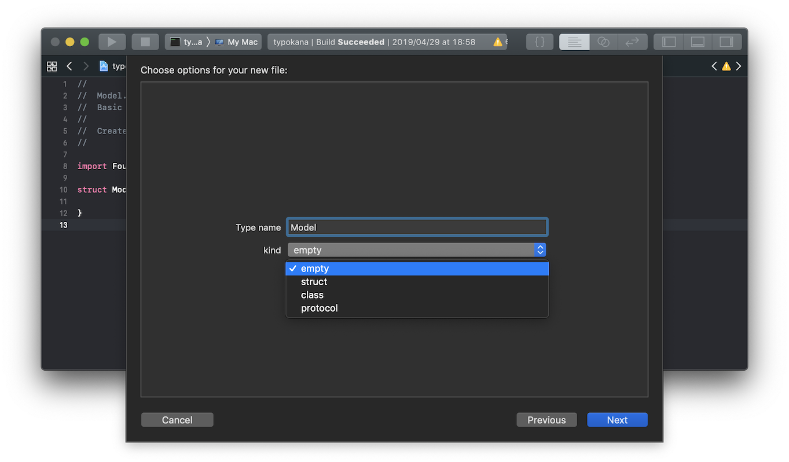

# SwiftTemplate

This xctemplate can create swift files for `struct`, `class`, `protocol`.

## Usage

we can use this template as Xcode template by copying [Swift.xctemplate](https://github.com/ezura/SwiftTemplate/tree/master/Swift.xctemplate) into ~/Library/Developer/Xcode/Templates.
